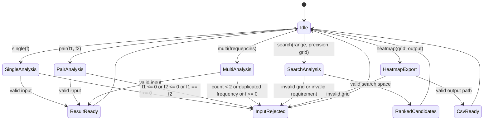

# Model Based Test TSD

## 文件資訊

| 欄位 | 內容 |
|--------|--------|
| 專案 | iToF Multi-Frequency Planner |
| 文件類型 | TSD, Test Specification Document |
| 測試方法 | MBT, Model Based Test |
| 測試對象 | `itof_planner.core`, `itof_planner.cli` |
| 版本 | 0.1 |
| 日期 | 2026-05-24 |

---

## 1. 測試目標

本 TSD 定義 iToF 多頻率規劃工具的模型化測試設計，用於驗證：

1. 單頻 unambiguous range 計算正確。
2. phase noise 到 distance precision 的傳播正確。
3. 雙頻 synthetic range 與 noise amplification 計算正確。
4. 多頻率 joint synthetic range、pair range、combined precision 計算正確。
5. 頻率組合搜尋可依 range、precision、robustness 產生排序結果。
6. CLI 行為與 core model 行為一致。
7. 錯誤輸入會被拒絕，且不產生無效分析結果。

---

## 2. 測試範圍

### 2.1 In Scope

- `unambiguous_range_m`
- `distance_precision_m`
- `synthetic_range_m`
- `analyze_frequency`
- `analyze_pair`
- `analyze_multi_frequency`
- `search_frequency_sets`
- CLI commands:
  - `single`
  - `pair`
  - `multi`
  - `search`
  - `heatmap`

### 2.2 Out of Scope

- GUI 或 Web UI。
- 真實 sensor raw phase input parsing。
- Multipath simulation。
- Motion simulation。
- Bayesian phase unwrapping。
- AI assisted unwrapping。

---

## 3. 系統模型

### 3.1 Domain Model

| 名稱 | 說明 | 單位 |
|--------|--------|--------|
| `f` | modulation frequency | MHz |
| `phase_noise` | phase standard deviation | rad |
| `R` | single-frequency unambiguous range | m |
| `R_syn` | two-frequency synthetic range | m |
| `sigma_d` | distance precision | m |
| `beat_noise` | synthetic beat distance noise | m |
| `noise_amp` | noise amplification factor | ratio |
| `robustness` | unwrap robustness label | High / Medium / Low |

### 3.2 Mathematical Oracle

MBT oracle 使用以下公式判定 expected result：

```text
R = c / (2f)

sigma_d = c / (4 * pi * f) * sigma_phi

R_syn = c / (2 * |f1 - f2|)

beat_noise = c / (4 * pi * |f1 - f2|) * sqrt(2) * sigma_phi

combined_precision = 1 / sqrt(sum(1 / sigma_d_i^2))

joint_repeat_range = c / (2 * gcd(f1, f2, ..., fn))

noise_amp = max(frequencies) / min_pair_delta
```

注意：

- 測試輸入 frequency 使用 MHz。
- 公式內部 frequency 需轉為 Hz。
- `joint_repeat_range` 使用 Hz integer grid 的 gcd。

### 3.3 State Model



---

## 4. MBT Input Partitions

### 4.1 Frequency Partition

| Partition ID | 條件 | 範例 | Expected |
|--------|--------|--------|--------|
| FQ-01 | `f <= 0` | `0`, `-10` | reject |
| FQ-02 | low valid frequency | `10`, `20` | valid |
| FQ-03 | mid valid frequency | `60`, `80` | valid |
| FQ-04 | high valid frequency | `100`, `150` | valid |
| FQ-05 | equal pair frequency | `80`, `80` | reject |
| FQ-06 | close pair frequency | `80`, `75` | valid, high synthetic range, higher beat noise |
| FQ-07 | far pair frequency | `20`, `100` | valid, lower synthetic range, lower beat noise |

### 4.2 Phase Noise Partition

| Partition ID | 條件 | 範例 | Expected |
|--------|--------|--------|--------|
| PN-01 | omitted | no `--phase-noise` | precision fields are `None` or hidden in CLI |
| PN-02 | zero noise | `0` | precision and beat noise are `0` |
| PN-03 | nominal noise | `0.01` | valid |
| PN-04 | negative noise | `-0.01` | reject |

### 4.3 Search Requirement Partition

| Partition ID | 條件 | 範例 | Expected |
|--------|--------|--------|--------|
| SR-01 | invalid min/max | `min >= max` | reject |
| SR-02 | invalid step | `step <= 0` | reject |
| SR-03 | invalid count | `count < 2` | reject |
| SR-04 | impossible range | max distance too large | candidates may fail range |
| SR-05 | nominal design case | `20..120 MHz`, step `20`, count `3` | ranked candidates returned |

---

## 5. Model Invariants

| Invariant ID | 規則 |
|--------|--------|
| INV-01 | `unambiguous_range_m(f)` must decrease when `f` increases. |
| INV-02 | `distance_precision_m(f, noise)` must decrease when `f` increases for fixed noise. |
| INV-03 | `distance_precision_m(f, noise)` must scale linearly with `noise`. |
| INV-04 | `synthetic_range_m(f1, f2)` must be symmetric. |
| INV-05 | `synthetic_range_m(f1, f2)` must increase when `|f1 - f2|` decreases. |
| INV-06 | pair frequencies must be distinct and positive. |
| INV-07 | multi-frequency input must contain at least two distinct positive frequencies. |
| INV-08 | `combined_precision_m` must be less than or equal to the best single-frequency precision when noise is provided. |
| INV-09 | `min_pair_delta_mhz` must equal the minimum absolute pair delta. |
| INV-10 | search output length must be less than or equal to `limit`. |
| INV-11 | search output must be sorted by pass status, score, then robustness proxy. |
| INV-12 | CLI output must be consistent with core API result within formatting tolerance. |

---

## 6. Abstract Test Cases

### 6.1 Core Formula Tests

| Test ID | Model Transition | Input | Expected Oracle |
|--------|--------|--------|--------|
| MBT-CORE-001 | `Idle -> SingleAnalysis -> ResultReady` | `f=80` | `R ~= 1.8737 m` |
| MBT-CORE-002 | `Idle -> SingleAnalysis -> ResultReady` | `f=20` | `R ~= 7.4948 m` |
| MBT-CORE-003 | `Idle -> SingleAnalysis -> ResultReady` | `f=100`, `phase_noise=0.01` | `sigma_d ~= 2.3857 mm` |
| MBT-CORE-004 | `Idle -> PairAnalysis -> ResultReady` | `f1=80`, `f2=70` | `R_syn ~= 14.9896 m` |
| MBT-CORE-005 | `Idle -> PairAnalysis -> ResultReady` | `f1=80`, `f2=75` | `R_syn ~= 29.9792 m` |
| MBT-CORE-006 | `Idle -> PairAnalysis -> ResultReady` | `f1=75`, `f2=80` | same as MBT-CORE-005 |
| MBT-CORE-007 | `Idle -> MultiAnalysis -> ResultReady` | `20,60,100`, `phase_noise=0.01` | joint range `~= 7.4948 m`, min delta `40 MHz` |
| MBT-CORE-008 | `Idle -> SearchAnalysis -> RankedCandidates` | `20..120`, step `20`, count `3`, max distance `5m`, target precision `5mm`, noise `0.01` | top result passes range and precision |

### 6.2 Validation Tests

| Test ID | Model Transition | Input | Expected |
|--------|--------|--------|--------|
| MBT-VAL-001 | `SingleAnalysis -> InputRejected` | `f=0` | `ValueError` |
| MBT-VAL-002 | `SingleAnalysis -> InputRejected` | `f=-10` | `ValueError` |
| MBT-VAL-003 | `PairAnalysis -> InputRejected` | `80,80` | `ValueError` |
| MBT-VAL-004 | `PairAnalysis -> InputRejected` | `80,-10` | `ValueError` |
| MBT-VAL-005 | `MultiAnalysis -> InputRejected` | `[80]` | `ValueError` |
| MBT-VAL-006 | `MultiAnalysis -> InputRejected` | `[20,60,60]` | `ValueError` |
| MBT-VAL-007 | `SearchAnalysis -> InputRejected` | `min=120`, `max=20` | `ValueError` |
| MBT-VAL-008 | `SearchAnalysis -> InputRejected` | `step=0` | `ValueError` |
| MBT-VAL-009 | `SearchAnalysis -> InputRejected` | `target_precision=0` | `ValueError` |
| MBT-VAL-010 | `SearchAnalysis -> InputRejected` | `phase_noise=-0.01` | `ValueError` |

### 6.3 CLI Tests

| Test ID | Command | Expected |
|--------|--------|--------|
| MBT-CLI-001 | `python3 -m itof_planner.cli single 80 --phase-noise 0.01` | output contains `Unambiguous range` and `Distance precision` |
| MBT-CLI-002 | `python3 -m itof_planner.cli pair 80 75 --phase-noise 0.01` | output contains `Synthetic range`, `Beat noise`, `Unwrap robustness` |
| MBT-CLI-003 | `python3 -m itof_planner.cli multi 20 60 100 --phase-noise 0.01` | output contains pair ranges and combined precision |
| MBT-CLI-004 | `python3 -m itof_planner.cli search --min 20 --max 120 --step 20 --count 3 --max-distance 5 --target-precision-mm 5 --phase-noise 0.01 --top 3` | output contains 3 ranked candidates |
| MBT-CLI-005 | `python3 -m itof_planner.cli heatmap --min 20 --max 40 --step 10 --phase-noise 0.01 --output outputs/test_pair_heatmap.csv` | CSV file exists with expected header |
| MBT-CLI-006 | `python3 -m itof_planner.cli pair 80 80` | process exits non-zero |

---

## 7. Concrete Test Data

| Data ID | Input | Expected Key Results |
|--------|--------|--------|
| TD-001 | `f=10 MHz` | `R ~= 14.9896 m` |
| TD-002 | `f=20 MHz` | `R ~= 7.4948 m` |
| TD-003 | `f=80 MHz` | `R ~= 1.8737 m` |
| TD-004 | `f=100 MHz`, `noise=0.01 rad` | `sigma_d ~= 2.3857 mm` |
| TD-005 | `80/70 MHz` | `R_syn ~= 14.9896 m` |
| TD-006 | `80/75 MHz` | `R_syn ~= 29.9792 m`, robustness `Low` when noise is `0.01 rad` |
| TD-007 | `20/60/100 MHz` | joint range `~= 7.4948 m`, combined precision `~= 2.016 mm` |
| TD-008 | search `20..120 MHz`, step `20`, count `3` | ranked candidates include `20/60/100` |

---

## 8. Traceability Matrix

| Requirement | README 功能 | MBT Tests |
|--------|--------|--------|
| REQ-01 | 頻率計算器 | MBT-CORE-001, MBT-CORE-002, MBT-CLI-001 |
| REQ-02 | 頻率對分析器 | MBT-CORE-004, MBT-CORE-005, MBT-CORE-006, MBT-CLI-002 |
| REQ-03 | 多頻率分析器 | MBT-CORE-007, MBT-CLI-003 |
| REQ-04 | Heatmap | MBT-CLI-005 |
| REQ-05 | 最佳頻率搜尋器 | MBT-CORE-008, MBT-CLI-004 |
| REQ-06 | 錯誤輸入防護 | MBT-VAL-001 to MBT-VAL-010, MBT-CLI-006 |
| REQ-07 | Phase noise propagation | MBT-CORE-003, TD-004, TD-006, TD-007 |

---

## 9. Coverage Criteria

MBT 測試產生器或手寫測試需至少滿足：

1. State coverage: 每個狀態至少被走訪一次。
2. Transition coverage: 每個有效與無效 transition 至少被觸發一次。
3. Boundary coverage: `0`, negative value, duplicate frequency, close frequency pair, far frequency pair。
4. Formula coverage: 每個 oracle formula 至少被驗證一次。
5. CLI coverage: 每個 command 至少一個成功案例。
6. Error coverage: core API 與 CLI 至少各一個錯誤案例。

---

## 10. Automation Mapping

| MBT Artifact | Python Test Target |
|--------|--------|
| Model state | pytest/unittest fixture |
| Transition | function call or CLI subprocess |
| Oracle | formula assertion with tolerance |
| Invalid transition | `assertRaises(ValueError)` or non-zero CLI exit |
| Heatmap output | temporary directory CSV assertion |
| Traceability | test id in test method docstring or test name |

建議後續新增：

```text
tests/test_mbt_core.py
tests/test_mbt_cli.py
```

命名範例：

```text
test_mbt_core_001_single_80mhz_range
test_mbt_val_003_reject_equal_pair_frequency
test_mbt_cli_005_heatmap_csv_header
```

---

## 11. Entry And Exit Criteria

### Entry Criteria

- Python package 可 import。
- CLI 可透過 `python3 -m itof_planner.cli --help` 執行。
- README 中公式與 CLI 用法已更新。

### Exit Criteria

- 所有 MBT concrete test cases 通過。
- 所有 validation tests 通過。
- CLI commands 在 nominal cases 下 exit code 為 `0`。
- invalid CLI command exit code 非 `0`。
- heatmap CSV header 與資料列符合 schema。

---

## 12. Known Assumptions

1. 本工具目前使用 deterministic formula 作為 oracle，尚未納入 sensor calibration error。
2. 多頻率 joint synthetic range 使用 frequency Hz integer grid 的 gcd repeat model。
3. Robustness label 是工程分類，不是實測 sensor pass/fail 判定。
4. Heatmap 第一版輸出 CSV，不直接產生圖檔。
5. Phase noise 預設代表每個頻率的 independent Gaussian phase noise。
